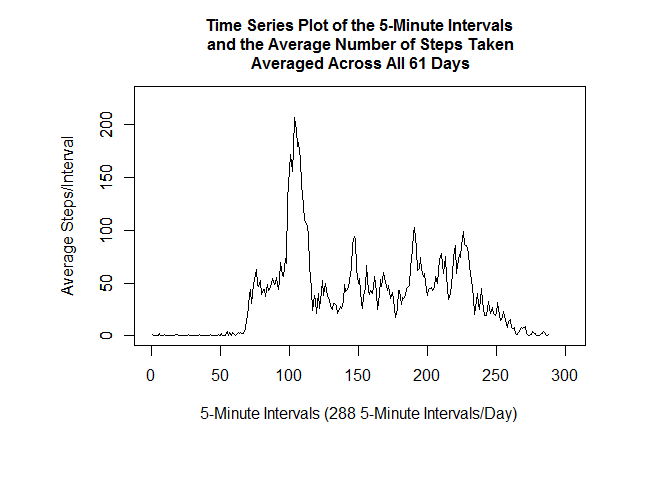

# Reproducible Research: Peer Assessment 1
Joe Lantz  


## Loading and preprocessing the data
- The data, sample plots, and instructions where forked from the [rdpeng GitHub Repository](http://github.com/rdpeng/RepData_PeerAssessment1) 
- A copy of this Fork was cloned to my computer 
- The zip file was csv file was read into RStudio with the following code:

```r
unzip ("./activity.zip", exdir = "./data")
actdata<- read.csv("./data/activity.csv")
```
## What is mean total number of steps taken per day?

```r
# Sum steps for each day
sumstepday <-with(actdata, tapply(steps, date,sum,na.rm=TRUE))
# Get the the mean of the total number of steps/day - 
meansteps <- as.integer(mean(sumstepday))
# Get the median of the total number of steps/day
mediansteps <-median(sumstepday)
```

- Data was collected over 61 days
        from 2012-10-01 until 2012-11-30
- Missing values in the data set were ignored 
- The mean total number of steps taken per day was **9354**
- The median of the total number of steps taken per day was **10395**
- The maximum number of steps taken during the period was 21194
- The minimum number of steps taken during the period was 0


### Make a histogram of the total number of steps taken each day


```r
par(mar=c(7.0, 7.0, 4.5, 4.5))
sumstepday <-with(actdata, tapply(steps, date,sum,na.rm=TRUE))
hist(sumstepday,col="green", 
     breaks = 7,
     main = "Histogram of Total Step/Day", xlab = "Total Steps/Day")
box()
```

<!-- -->

## What is the average daily activity pattern?
#### -  Make a time series plot 


```r
# Average the steps taken over the 5 minute intervals over the time period

meanintersteps <- as.integer(with(actdata, tapply(steps, interval,mean,na.rm=TRUE)))
par(mar=c(7.0, 7.0, 4.5, 4.5))
max_y <- max(meanintersteps)
intervals <-c(0:287)
max_x <- max(intervals)
plot(intervals, meanintersteps,type="l",
        xlab= "5-Minute Intervals (288 5-Minute Intervals/Day)", 
        ylab = "Average Steps/Interval",
        ylim=c(0,max_y*1.1),
        xlim=c(0,max_x*1.05))
axis(2, las=0) # Axis label parallel to axis
box()
title(main = "Time Series Plot of the 5-Minute Intervals\n and the Average Number of Steps Taken\n Averaged Across All 61 Days", cex.main=0.9999)
```

<!-- -->

```r
maxinterval <- which.max(meanintersteps)
maxsteps <- max(meanintersteps)
maxtime <- paste(as.integer(maxinterval*5/60),":",(maxinterval*5)%%60," am", sep = "")
```

- The maximum number of steps taken for any interval was **206 **
- This Interval was **104 **
- This occurred at **8:40 am**

## Imputing missing values
#### - Calculate and report the total number of missing values in the dataset 


```r
summissval <- sum(is.na(actdata$steps))
```

- The number of missing values in the dataset is **2304**

#### - Devise a strategy for filling in all of the missing values in the dataset.


```r
# Get midpoint of the data.set
intervaltime <- paste(as.integer(actdata$interval/100),":",actdata$interval%%100,":00",sep="")
datetime <- strptime(paste(actdata$date,intervaltime), format = "%Y-%m-%d %H:%M:%S")
datetimect <- as.POSIXct(datetime)
actdatadt <- cbind(datetimect,actdata)
middatenum <- unclass(actdatadt$datetimect[dim(actdatadt)[1]/2])
##
# The follow code replaces the NA's with a value from the same time next day
# - if the date is before before Nov 1 - or the same time previous day - if the value 
# is after Nov 1
##
# Create a new data.set
actdatadtnoNA <- actdatadt
for (i in 1:dim(actdatadtnoNA)[1]) 
{       if(is.na(actdatadtnoNA$steps[i]))
        {       j <- ifelse (unclass(actdatadtnoNA$datetimect[i]) <middatenum,1,-1)
                k = 1
                repeat
                {       if(!is.na(actdatadtnoNA$steps[i+289*j*k]))
                        {       actdatadtnoNA$steps[i] <- actdatadtnoNA$steps[i+289*j*k]
                                break
                        }
                        else k = k +1
                }
        }
}
```

#### - Calculate and report the mean and median total number of steps taken per day. 
#### - Do these values differ from the estimates from the first part of the assignment? 


```r
# Sum steps for each day
sumstepdaynoNA <-with(actdatadtnoNA, tapply(steps, date,sum,na.rm=TRUE))
# Get the the mean of the total number of steps/day - 
meanstepsnoNA <- as.integer(mean(sumstepdaynoNA))
# Get the median of the total number of steps/day
medianstepsnoNA <-median(sumstepdaynoNA)
# Get the minimum steps/day
```

- Data was collected over 61 days
        from 2012-10-01 until 2012-11-30
- Missing values in the data set substituted by values for the same time from previous or future days
- The **mean** total of the number of steps taken per day was **10334**, estimates replaced NA data
- &ensp;&ensp;&ensp;The **mean** total of the number of steps taken per day was **9354**, NA data removed (value from above)
- The **median** of the total number of steps taken per day was **10571**, estimates replaced NA data
- &ensp;&ensp;&ensp;The **median** of the total number of steps taken per day was **10395**, NA data removed (value from above)

#### - Make a histogram of the total number of steps taken each day with missing values filled in.  


```r
par(mar=c(7.0, 7.0, 4.5, 4.5))
sumstepdaynoNA <-with(actdatadtnoNA, tapply(steps, date,sum,na.rm=TRUE))
hist(sumstepdaynoNA,col="blue", 
     breaks = 7,
     main = "Histogram of Total Step/Day With MIssing Values Filled In ", xlab = "Total Steps/Day")
box()
```

<!-- -->

#### - What is the impact of inputing missing data on the estimates of the total daily number of steps?


```r
plot(1:61, sumstepday,type="l",
        xlab= "Days In 2-Month Collection Time Period", 
        ylab = "Total Daily Steps",
        ylim=c(0,max(sumstepday)*1.1),
        lty = 2,
        col = "red",
        lwd =2,
        xlim=c(0,61*1.05))
axis(2, las=0) # Axis label parallel to axis
box()
title(main = "Daily Sum of Steps Taken Showing the Impact of\n Inputing the Missing Data", cex.main=0.9999)
lines(sumstepdaynoNA, col = "blue", type = "l")
legend(1, max(sumstepday)*1.1, c("NA data removed","NA data estimated"), 
       cex=0.8, col=c("red","blue"),lwd = c(2,1), lty = c(2,1))
```

<!-- -->

## Are there differences in activity patterns between weekdays and weekends?


```r
library(dplyr)
```

```
## 
## Attaching package: 'dplyr'
```

```
## The following objects are masked from 'package:stats':
## 
##     filter, lag
```

```
## The following objects are masked from 'package:base':
## 
##     intersect, setdiff, setequal, union
```

```r
library(ggplot2)
library(lattice)
#
actdays <- weekdays(actdatadtnoNA$datetimect)
actdays[actdays == "Monday" | actdays == "Tuesday" | actdays == "Wednesday"| 
        actdays == "Thursday"| actdays == "Friday" ] <- "weekday"
actdays[actdays == "Saturday" | actdays == "Sunday" ] <- "weekend"
actdays <- factor(actdays)
actdatadtnoNA <- cbind(actdays,actdatadtnoNA)
#

groupintdays<- group_by(actdatadtnoNA,interval,actdays)
sumintdays<- summarise(groupintdays,mean=as.integer(mean(steps)))
#png(file= "plot6.png",width = 480, height = 480)
g<-ggplot(sumintdays, aes(x=interval,y=mean, group=actdays))
g + geom_line(size=1.5,aes(colour = actdays)) +
        ggtitle("Comparing Weekdays With Weekends") +
        labs(x="Intervals",y="Steps") 
```

<!-- -->

```r
xyplot( mean ~ interval | actdays, data=sumintdays,  
        layout=c(1,2),type= "l",
        xlab = "Interval (Raw Intervals from dataset)",
        ylab = "Mean steps/interval")
```

<!-- -->

